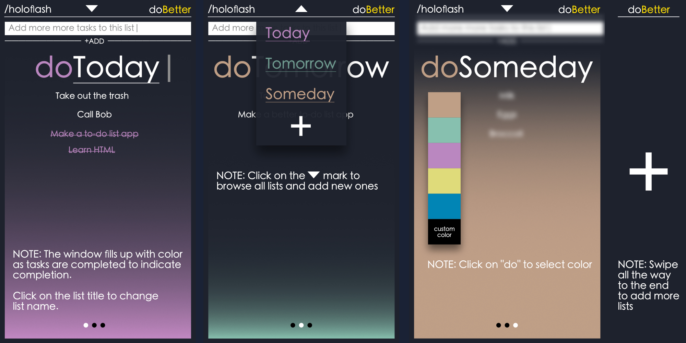

# doBetter

doBetter is a task management application that aims to help you focus on the tasks at hand and increase your productivity. With a simple and intuitive interface, doBetter makes it easy to add new tasks to your current list using the text box located at the top of the window.

doBetter comes with three default lists: "Today", "Tomorrow", and "Someday". These lists can be easily renamed to fit your specific needs by simply clicking on the title. If you no longer need a particular list, you can remove it by clicking and holding anywhere on the current window.

Easily access all of your lists through the dropdown menu located at the top of the window.

Alternatively, you can navigate between lists using the left and right swipe gestures or by clicking the dots at the bottom of the window.

Simply click the "+" icon in the dropdown menu to create a new list. The "+" can also be reached by navigating to the last list and swiping left.

Customize the color of your current list to your preference by using the dropdown menu accessed by clicking on "do".
