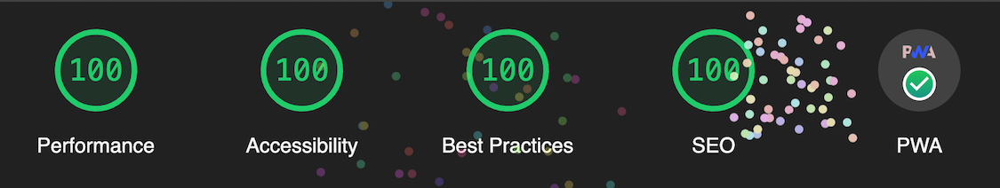

# doBetter

Live: https://holoflash.github.io/doBetter/

A responsive and multi-device compatible to-do app built with vanilla JavaScript,vanilla CSS, HTML and WebPack.

## Notable features

-   Persistence via localStorage
-   Installable as an app on mobile
-   Interactive user guide
-   Super responsive by only using relative size units
-   Two distinct site views with barely any additional overhead

## Google Lighthouse

Maximum score in all categories and all PWA requirements fulfilled.

